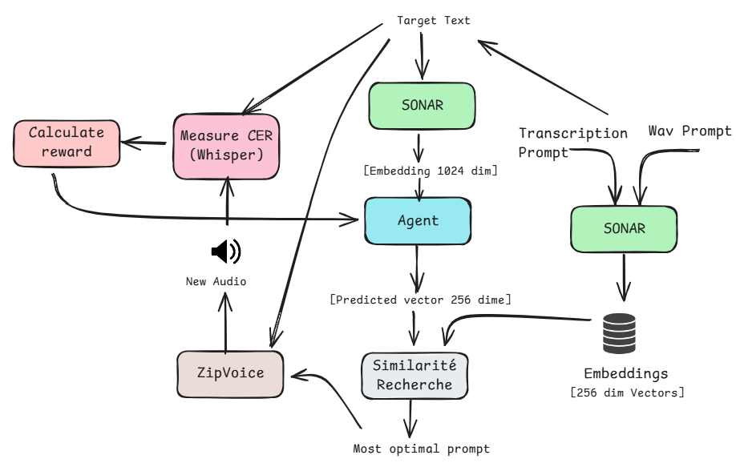
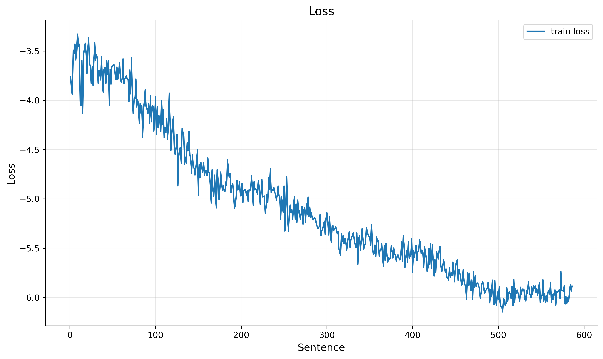
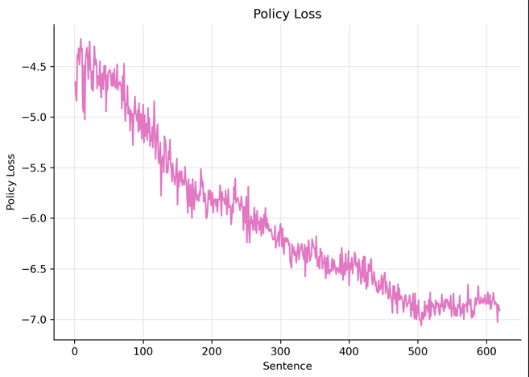

# Contextual Bandit Agent for ZipVoice Prompt Selection

## Overview
This repository contains the implementation of a Reinforcement Learning (RL) agent designed to optimize prompt selection for the ZipVoice Text-to-Speech model. The agent utilizes a Contextual Bandit approach to learn the mapping between input text and the optimal audio prompt embedding, aiming to minimize the Character Error Rate (CER) of the generated audio. The system operates in a one-shot learning manner, updating its policy based on the quality of the generated speech.

## Structure
The project is organized as follows:

```
Agent/
├── assess_CER/             # Scripts for calculating CER and Reward
│   ├── calculate_cer.py    # Computes CER using Whisper ASR
│   └── weighted_cer.py     # Converts CER to a reward signal
├── DB/                     # Vector Database generation scripts
│   ├── generate_embeddings.py      # Generates FAISS index from audio
│   ├── generate_raw_embeddings.py  # Generates raw embeddings
│   ├── run_generate_embeddings.sh  # Shell script to run embedding generation
│   └── run_generate_raw_embeddings.sh
├── generate_audio/         # Interface for ZipVoice inference
│   └── generate_with_zipVoice.py
├── logs_agent/             # Directory for SLURM execution logs
├── model/                  # Neural Network definitions and training logic
│   ├── __init__.py
│   ├── agent_model.py      # Agent architecture with residual blocks (1024 -> 256)
│   ├── model_cache.py      # Singleton cache for SONAR/Whisper models
│   ├── replay_buffer.py    # Experience replay buffer
│   ├── train_agent.py      # Training with contrastive loss and value estimation
│   └── utils.py            # Utility functions
├── scripts/                # Utility scripts
│   ├── compute_prompt_centroids.py  # K-means clustering for exploration
│   └── monitor_diversity.py         # Prompt selection diversity tracking
├── Similarity/             # Vector similarity search
│   └── asess_similarty.py  # FAISS search logic
├── temp_pipeline/          # Temporary storage for pipeline artifacts
├── requirements.txt        # Python dependencies
└── run_pipeline.sh         # Main SLURM pipeline script
```

## Requirements

To set up the environment, follow these steps:

```bash
# Create and activate the environment
conda create -n agent_env python=3.10
conda activate agent_env

# Install dependencies
pip install -r requirements.txt
```

**Note:** The pipeline assumes the existence of a separate environment `zipvoice_py311` for the ZipVoice inference model, as configured in `generate_with_zipVoice.py`.

## Run Pipeline

To run the full RL pipeline on a specific French sentence using SLURM:

```bash
sbatch run_pipeline.sh "Votre phrase en français ici"
```

This script will execute the 7-step pipeline for a defined number of iterations (default: 10), performing inference, evaluation, and model updates in a loop.

## Prerequisites

### Data Source
The agent is trained on the **NEB** speaker subset of the **Blizzard Challenge 2023** dataset. This dataset consists of approximately 64,000 audio segments ranging from 3 to 7 seconds.

### Vector Database
We have created a vector database of audio prompts to serve as the action space for the bandit. The database generation process is handled by `Agent/DB/generate_embeddings.py`:

1.  **Encoding**: SONAR Speech Encoder (`sonar_speech_encoder_fra`) encodes each audio prompt into a 1024-dimensional vector.
2.  **Dimensionality Reduction**: Vectors are reduced from 1024 to 256 dimensions to create a compact latent space compatible with FAISS similarity search.
3.  **Storage**:
    *   `prompts.index`: The FAISS index (`faiss.IndexFlatL2`) used for fast similarity search.
        *   **Total Vectors**: ~63,478 (full dataset) or 1,000 (test subset)
        *   **Dimension**: 256
        *   **Metric**: L2 Distance (vectors are L2-normalized for cosine similarity compatibility).
    *   `prompts_metadata.pkl`: A serialized Python list containing metadata for each vector in the index (aligned by index position).
        *   **Structure**: List of dictionaries.
        *   **Item Example**:
            ```python
            {
                'wav_name': 'ES_LMP_NEB_01_0001_24592_25697',
                'prompt_transcription': 'Le tapis-franc...',
                'prompt_wav': '/info/corpus/Blizzard2023_segmented/segmented/NEB_train/...'
            }
            ```

## Details in Functioning

The pipeline consists of 7 steps that repeat for every iteration to simulate online learning:

**Step 1: Text Encoding**
The input French sentence is encoded using the **SONAR Text Encoder** (`text_sonar_basic_encoder`). This produces a 1024-dimensional semantic vector representation of the target text.

**Step 2: Agent Prediction**
The **Agent Model** (a deep neural network with residual blocks) takes the 1024-dim text vector as input and predicts a 256-dimensional vector. This output represents the "ideal" prompt embedding in the latent space that the agent believes will yield the best speech synthesis for the given text. The model architecture includes:

**Step 3: Similarity Search**
The system performs a Cosine Similarity search using **FAISS** between the agent's predicted vector and the pre-computed database of prompt embeddings. It retrieves the nearest neighbor (the most similar existing audio prompt) and returns its ID, WAV path, and transcription. The vectors are L2-normalized to ensure cosine similarity compatibility.

**Step 4: Audio Generation**
Using the retrieved prompt (audio and text) and the original target text, the **ZipVoice** model generates the corresponding speech audio.

**Step 5: CER Calculation**
The generated audio is transcribed using **OpenAI Whisper (Large V3)**. The transcription is compared against the original target text to calculate the Character Error Rate (CER).

**Step 6: Reward Calculation**
The CER is converted into a reward signal (Scalar [0, 1]). A lower CER results in a higher reward (e.g., `Reward = max(0, 1 - CER)`).

**Step 7: Agent Update (Contextual Bandit)**
The agent is updated using the collected experience tuple `(State, Action, Reward)`.
*   **State**: Input text vector (1024-dim).
*   **Action**: The actual vector of the retrieved prompt (256-dim).
*   **Reward**: The calculated reward.

The model uses a hybrid loss function combining:

The training employs experience replay with prioritized sampling and epsilon-greedy exploration with gradual decay.


### Agent Model Structure

The agent is implemented as a **Deep Residual Network** using PyTorch, designed to map the semantic space of input text to the latent space of audio prompts.

*   **Input Layer**: Accepts a **1024-dimensional** vector (SONAR Text Embedding).
*   **Input Projection**: **Linear** (1024 → 512) → **LayerNorm** → **GELU** → **Dropout** (0.2)
*   **Residual Blocks** (3 blocks): Each block contains:
    *   **LayerNorm** → **Linear** (512 → 2048) → **GELU** → **Dropout** → **Linear** (2048 → 512) → **Dropout**
    *   Residual connection: output = input + block(input)
*   **Action Head** (policy): **LayerNorm** → **Linear** (512 → 512) → **GELU** → **Dropout** → **Linear** (512 → 256)
    *   Outputs a 256-dim embedding representing prompt space coordinates
*   **Value Head**: **LayerNorm** → **Linear** (512 → 128) → **GELU** → **Linear** (128 → 1)
    *   Estimates expected reward for advantage-based updates

**Architecture Features**:
- **Residual connections**: Better gradient flow for deep networks
- **Pre-layer normalization**: Training stability
- **GELU activation**: Smoother gradients than ReLU
- **Manifold-aware exploration**: 64 k-means centroids guide exploration in prompt space
- **Diversity tracking**: Monitors prompt usage frequency to prevent collapse

### The Reinforcement Learning Policy

The system utilizes a **Contextual Bandit** formulation with advanced exploration strategies to optimize the prompt selection policy in an online setting.

*   **State (`s`)**: The 1024-dim embedding of the input text.
*   **Action (`a`)**: The 256-dim embedding of the audio prompt.
*   **Policy (`π_θ`)**: A deep neural network that predicts an ideal action vector  
    `â = π_θ(s)`.  
    The actual action taken is the **Nearest Neighbor** of `â` in the pre-computed vector database (FAISS index).

*   **Update Rule (Hybrid Loss)**:
    The model parameters `θ` are updated using a combination of losses:
            L_contrastive =  λ(R) · || π_θ(s) − a_retrieved ||²

        If R ≤ R_mean (repulsion):
            L_contrastive = −λ(R) · || π_θ(s) − a_retrieved ||²
        ```

        Where `λ(R)` is a dynamic weight based on normalized reward.

    2.  **Value Loss** (advantage estimation):

        ```text
        L_value = ( V_φ(s) − R )²
        ```

        Where `V_φ(s)` is the predicted value from the value head.

    3.  **Entropy Regularization** (exploration):

        ```text
        L_entropy = −β_entropy · H(π_θ)
        ```

    4.  **Diversity Penalty** (prevent collapse):

        ```text
        L_diversity = β_diversity · ( count(a) / sum(counts) )
        ```

    **Total Loss**:

    ```text
    L(θ) = L_contrastive + L_value + L_entropy + L_diversity
    ```

*   **Exploration Strategy**:
    - **Epsilon-greedy**: With probability `ε` (decaying from 0.5 to 0.05), explore randomly.
    - **Manifold-aware exploration**: When exploring, sample from k-means centroids of prompt space.
    - **Fixed epsilon during warm-up**: Prevents premature exploitation before learning.

*   **Experience Replay**:
    - Buffer stores `(state, action, reward)` tuples with maximum capacity (default: 1000).
    - Prioritized sampling: Higher rewards are sampled more frequently.
    - Batch updates with batch size 32.

## Pipeline Architecture

The following diagram illustrates the complete architecture of the reinforcement learning pipeline:

<p align="center">
  
</p>

## Training Results

The agent training demonstrates convergence through two key metrics:

<p align="center">
  
  
</p>

*Left: Total agent loss over training iterations. Right: Policy loss showing the convergence of the action prediction head.*

### File Descriptions

*   **`run_pipeline.sh`**: Main script running the 7-step RL loop on SLURM.
*   **`model/agent_model.py`**: Deep residual agent (1024 → 256 dim) with value head and manifold exploration.
*   **`model/train_agent.py`**: Performs contextual bandit updates with contrastive loss and regularization.
*   **`model/replay_buffer.py`**: Experience replay buffer with prioritized sampling.
*   **`model/model_cache.py`**: Singleton cache for SONAR and Whisper models to avoid reloading.
*   **`scripts/compute_prompt_centroids.py`**: K-means clustering (64 centroids) for manifold-aware exploration.
*   **`scripts/monitor_diversity.py`**: Tracks prompt selection diversity and generates visualizations.
*   **`DB/generate_embeddings.py`**: Creates the FAISS vector index from audio prompts (256-dim).
*   **`Similarity/asess_similarty.py`**: Finds the nearest prompt via Cosine Similarity (FAISS).
*   **`generate_audio/generate_with_zipVoice.py`**: Runs ZipVoice inference for TTS.
*   **`assess_CER/calculate_cer.py`**: Calculates CER using OpenAI Whisper.
*   **`assess_CER/weighted_cer.py`**: Computes the reward signal from CER.
